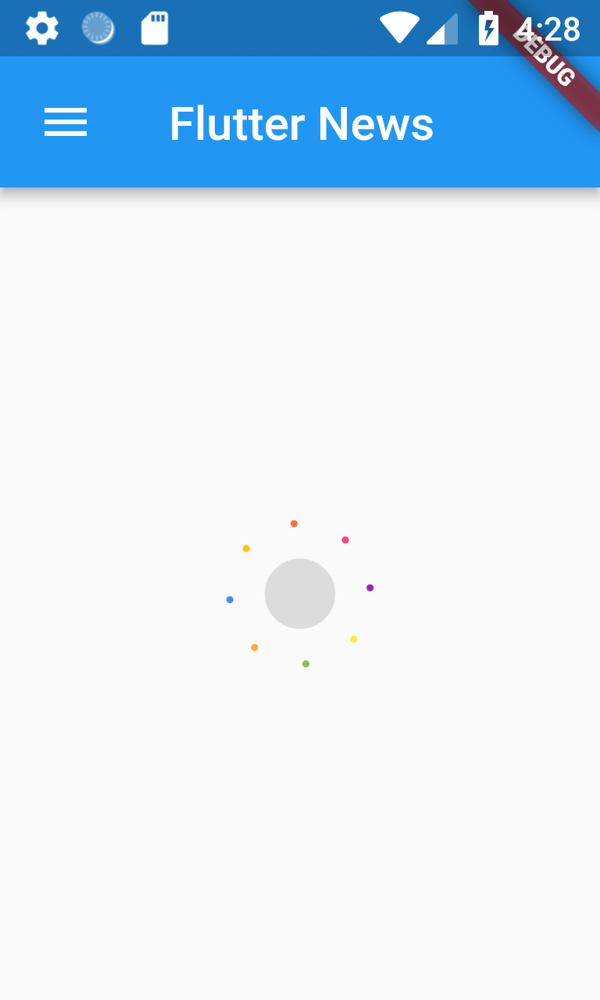
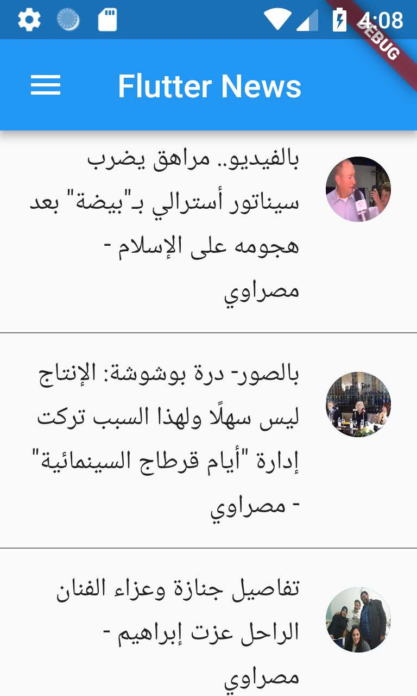
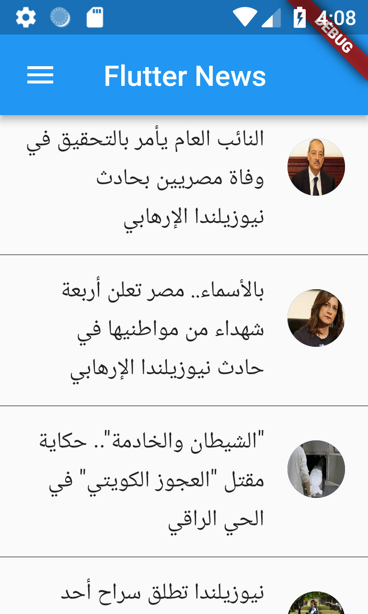
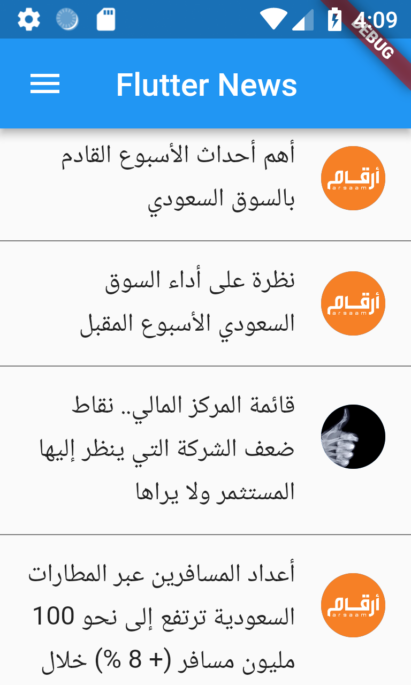

# Flutter News

Application description and feature:

The application load news from https://newsapi.org in a list view.
A loader keeps running until the application get the data.
When you click on one of the list tiles you will move to the description of the news with more details and a pictre.
There are 3 main news categories; Egypt News, Argaam News and Saudi Arabia News (More categories can be added later).
An interstitial ad that populates every 10 seconds.
The application is integrated with Firebase, Analytics and Messaging which allow us to puch notifications.

<html>
<head>
</head>
<body>
			<h2>Application Screens</h2>
				

				Loader
			

			

				Burger Menu
			

	
				Egypt News
			

	
				Saudi Arabia News
			

			
				Argaam News
			

			
				interstitial ad
			

			
				Description Page
			

			
				Notification
			

			
				About Page
			

      </body>
</html>

